# 🏛️ CampusOne / CampusHub - Complete Supabase Database Architecture

This guide provides everything needed to deploy and connect a complete, enterprise-grade PostgreSQL database on **Supabase** for the **CampusOne** Higher Education ERP platform.

---

## 📊 Database Architecture Overview

The system utilizes **22 relational tables** organized across 6 functional domains with comprehensive **Row Level Security (RLS)**, **foreign key constraints**, **indexes**, and **automated authentication triggers**.

```mermaid
erDiagram
    PROFILES ||--o| STUDENTS : "is a"
    PROFILES ||--o| FACULTY : "is a"
    PROFILES ||--o| ADMINS : "is a"
    
    DEPARTMENTS ||--o{ STUDENTS : "enrolled in"
    DEPARTMENTS ||--o{ FACULTY : "employed in"
    DEPARTMENTS ||--o{ COURSES : "offers"
    
    FACULTY ||--o{ COURSES : "teaches"
    COURSES ||--o{ COURSE_ENROLLMENTS : "has"
    STUDENTS ||--o{ COURSE_ENROLLMENTS : "attends"
    
    COURSES ||--o{ TIMETABLE : "scheduled in"
    COURSES ||--o{ ATTENDANCE : "logged for"
    STUDENTS ||--o{ ATTENDANCE : "marked for"
    
    COURSES ||--o{ ASSIGNMENTS : "has"
    ASSIGNMENTS ||--o{ ASSIGNMENT_SUBMISSIONS : "submitted to"
    STUDENTS ||--o{ ASSIGNMENT_SUBMISSIONS : "submits"
    
    COURSES ||--o{ EXAMS : "conducts"
    STUDENTS ||--o{ RESULTS : "earns"
    COURSES ||--o{ RESULTS : "graded in"
    
    COURSES ||--o{ STUDY_MATERIALS : "contains"
    COURSES ||--o{ VIDEO_LECTURES : "streams"
    COURSES ||--o{ QUIZZES : "tests"
    
    LIBRARY_BOOKS ||--o{ LIBRARY_BORROWS : "borrowed in"
    STUDENTS ||--o{ LIBRARY_BORROWS : "borrows"
    
    STUDENTS ||--o{ FEES : "billed to"
    FEES ||--o{ FEE_PAYMENTS : "paid via"
    
    HOSTEL_BLOCKS ||--o{ HOSTEL_ROOMS : "contains"
    HOSTEL_ROOMS ||--o{ HOSTEL_ALLOCATIONS : "allocated to"
    STUDENTS ||--o{ HOSTEL_ALLOCATIONS : "resides in"
    
    TRANSPORT_ROUTES ||--o{ TRANSPORT_STOPS : "serves"
    TRANSPORT_ROUTES ||--o{ TRANSPORT_ALLOCATIONS : "subscribed to"
    STUDENTS ||--o{ TRANSPORT_ALLOCATIONS : "holds pass"
    
    PLACEMENT_JOBS ||--o{ PLACEMENT_APPLICATIONS : "receives"
    STUDENTS ||--o{ PLACEMENT_APPLICATIONS : "applies for"
    
    PROFILES ||--o{ NOTIFICATIONS : "receives"
    PROFILES ||--o{ SERVICE_REQUESTS : "files"
```



---

## 🗄️ Database Tables Catalog

### 1. Identity & RBAC (Role-Based Access Control)
| Table | Description | Key Fields |
|---|---|---|
| `public.profiles` | Core user directory synced with `auth.users` | `id (UUID PK)`, `email`, `name`, `role`, `phone`, `gender` |
| `public.departments` | Academic branches & divisions | `id (UUID PK)`, `code`, `name`, `head_of_department`, `building` |
| `public.students` | Extended student records | `id (UUID PK -> profiles.id)`, `student_id`, `department`, `batch`, `semester`, `cgpa` |
| `public.faculty` | Extended faculty staff profiles | `id (UUID PK -> profiles.id)`, `faculty_id`, `designation`, `qualification`, `specialization` |
| `public.admins` | Administrative officer profiles | `id (UUID PK -> profiles.id)`, `admin_id`, `designation`, `office_location` |

### 2. Academics & Curriculum
| Table | Description | Key Fields |
|---|---|---|
| `public.courses` | Course catalog & syllabus | `id (UUID PK)`, `code`, `name`, `credits`, `course_type`, `faculty_id` |
| `public.course_enrollments` | Student course registrations | `id (UUID PK)`, `student_id`, `course_id`, `semester`, `status` |
| `public.timetable` | Weekly period schedules | `id (UUID PK)`, `course_id`, `faculty_id`, `day_of_week`, `start_time`, `end_time`, `classroom` |
| `public.attendance` | Daily course attendance logs | `id (UUID PK)`, `student_id`, `course_id`, `date`, `status (Present/Absent/Late)` |
| `public.assignments` | Course coursework tasks | `id (UUID PK)`, `course_id`, `title`, `due_date`, `max_marks`, `attachment_url` |
| `public.assignment_submissions` | Student submissions & grades | `id (UUID PK)`, `assignment_id`, `student_id`, `submission_file_url`, `grade_marks`, `status` |
| `public.exams` | Examination schedules | `id (UUID PK)`, `course_id`, `title`, `exam_type`, `date`, `start_time`, `classroom` |
| `public.results` | Academic transcripts & grades | `id (UUID PK)`, `student_id`, `course_id`, `marks_obtained`, `grade`, `grade_points` |

### 3. Digital Learning Hub (LMS)
| Table | Description | Key Fields |
|---|---|---|
| `public.study_materials` | Downloadable notes, slides, manuals | `id (UUID PK)`, `course_id`, `title`, `module_number`, `material_type`, `file_url` |
| `public.video_lectures` | Course recorded lectures | `id (UUID PK)`, `course_id`, `title`, `duration_minutes`, `video_url`, `thumbnail_url` |
| `public.quizzes` | Self-assessment test modules | `id (UUID PK)`, `course_id`, `title`, `duration_minutes`, `passing_score` |
| `public.quiz_attempts` | Student quiz submissions | `id (UUID PK)`, `quiz_id`, `student_id`, `score`, `passed` |

### 4. Campus Infrastructure & Services
| Table | Description | Key Fields |
|---|---|---|
| `public.library_books` | Central library catalog | `id (UUID PK)`, `title`, `author`, `isbn`, `total_copies`, `available_copies` |
| `public.library_borrows` | Book checkout & return logs | `id (UUID PK)`, `book_id`, `student_id`, `borrow_date`, `due_date`, `fine_amount` |
| `public.fees` | Fee statements & invoices | `id (UUID PK)`, `student_id`, `title`, `fee_type`, `amount`, `due_date`, `status` |
| `public.fee_payments` | Payment receipts & transaction IDs | `id (UUID PK)`, `fee_id`, `student_id`, `amount_paid`, `payment_method`, `receipt_number` |
| `public.hostel_blocks` | Residential housing facilities | `id (UUID PK)`, `name`, `block_type`, `total_rooms`, `warden_name` |
| `public.hostel_rooms` | Individual hostel room allocations | `id (UUID PK)`, `block_name`, `room_number`, `floor`, `capacity`, `occupants_count` |
| `public.hostel_allocations` | Student room allotments | `id (UUID PK)`, `room_id`, `student_id`, `bed_number`, `status` |
| `public.hostel_requests` | Outpasses & maintenance tickets | `id (UUID PK)`, `student_id`, `request_type`, `title`, `description`, `status` |
| `public.transport_routes` | Campus bus routes & fleet | `id (UUID PK)`, `route_number`, `route_name`, `vehicle_number`, `driver_name` |
| `public.transport_stops` | Route pickup/drop stops | `id (UUID PK)`, `route_id`, `stop_name`, `pickup_time`, `drop_time` |
| `public.transport_allocations` | Student bus passes | `id (UUID PK)`, `route_id`, `stop_id`, `student_id`, `pass_number`, `valid_until` |

### 5. Placements & Career Portal
| Table | Description | Key Fields |
|---|---|---|
| `public.placement_jobs` | Corporate recruitment drives | `id (UUID PK)`, `company`, `role`, `package`, `cutoff_cgpa`, `deadline`, `status` |
| `public.placement_applications` | Job applications & selection status | `id (UUID PK)`, `job_id`, `student_id`, `resume_url`, `status`, `round_reached` |
| `public.placement_interviews` | Interview rounds & schedules | `id (UUID PK)`, `application_id`, `round_name`, `interview_date`, `meeting_link_or_venue` |
| `public.placement_prep_resources` | Aptitude, DSA & interview prep | `id (UUID PK)`, `title`, `category`, `resource_type`, `content_url` |
| `public.saved_jobs` | Student job bookmarks | `id (UUID PK)`, `student_id`, `job_id`, `saved_at` |

### 6. Communication & Help Center
| Table | Description | Key Fields |
|---|---|---|
| `public.notices` | Campus announcements & circulars | `id (UUID PK)`, `title`, `category`, `priority`, `target_audience`, `publish_date` |
| `public.notifications` | In-app push notifications | `id (UUID PK)`, `user_id`, `title`, `description`, `type`, `unread` |
| `public.service_requests` | Campus helpdesk support tickets | `id (UUID PK)`, `user_id`, `ticket_number`, `category`, `subject`, `status` |

---

## 🚀 Step-by-Step Setup Instructions

### Step 1: Create a Supabase Project
1. Log in to [Supabase Dashboard](https://supabase.com/dashboard).
2. Click **"New Project"**.
3. Name your project (e.g. `campus-one-production`) and configure a secure database password.
4. Select your preferred region and click **"Create New Project"**.

### Step 2: Execute Schema & Security Policies
1. In your Supabase Project dashboard, open the **SQL Editor** tab from the left sidebar.
2. Click **"New Query"**.
3. Open [`database_schema.sql`](file:///c:/Users/ganesh.r/.vscode/.gemini/antigravity/scratch/campus-hub/database_schema.sql) in this repository.
4. Copy and paste the entire script into the Supabase SQL Editor.
5. Click **"Run"** (Ctrl+Enter / Cmd+Enter).
   - This creates all 22 tables, helper security functions, indexes, and full RLS policies.

### Step 3: Populate Demo Seed Data
1. Open a new query in the Supabase SQL Editor.
2. Open [`seed_data.sql`](file:///c:/Users/ganesh.r/.vscode/.gemini/antigravity/scratch/campus-hub/seed_data.sql) in this repository.
3. Copy and paste the entire script into the Supabase SQL Editor.
4. Click **"Run"**.
   - This seeds sample departments, courses, timetables, attendance, grades, library books, fees, hostel rooms, transport, and placement drives.

### Step 4: Configure Project Environment Variables
1. In the Supabase Dashboard, go to **Project Settings** (gear icon) -> **API**.
2. Copy your **Project URL** and **`anon` `public` API Key**.
3. Open or create `.env.local` in your root project directory:

```env
# Supabase Configuration
VITE_SUPABASE_URL=https://your-project-id.supabase.co
VITE_SUPABASE_ANON_KEY=eyJhbGciOiJIUzI1NiIsInR5cCI6IkpXVCJ9...
```

4. Restart your development server:
```bash
npm run dev
```

---

## 🔒 Security Architecture: Row Level Security (RLS)

Every single table in CampusOne is secured by Row Level Security:

1. **Student Role Isolation**:
   - Students can only view their own attendance, grades, fee bills, hostel allocations, and placement applications.
   - Students cannot view other students' personal records or grades.
2. **Faculty Permissions**:
   - Faculty members can view and update their assigned courses, record class attendance, post assignments, and grade submissions.
3. **Admin Clearance**:
   - Institutional Admins possess full CRUD governance across all departments, courses, faculty, students, fee transactions, and placements.
4. **Infinite Recursion Protection**:
   - RLS policies utilize dedicated `SECURITY DEFINER` helper functions (`is_admin()`, `is_faculty_or_admin()`) that query `profiles` with fixed search paths.
